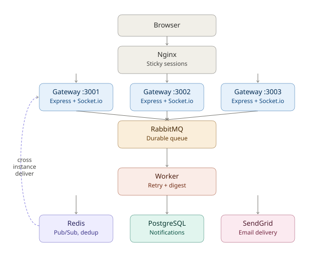

# 🔔 Notifly

A distributed notification infrastructure system — horizontally scaled, queue-backed, with retry logic, digest batching, and cross-instance real-time delivery.



---

## What it does

Any service sends an event. Notifly routes it across channels based on user preferences, delivers it in real time or batches it into a digest, retries on failure, and tracks the full lifecycle for analytics — all while running on multiple horizontally scaled instances.

POST /api/events
↓
RabbitMQ (durable queue — survives traffic spikes)
↓
Worker checks preferences → delivers or batches
↓
Redis Pub/Sub → whichever gateway instance holds
the user's WebSocket delivers it


## Why this architecture

**Message queue, not direct delivery.** A flash-sale spike sending 10,000 events at once would overwhelm a database write path. RabbitMQ absorbs the burst; the worker drains it at a sustainable rate.

**Horizontal scaling without sticky state in memory.** Three gateway instances run behind Nginx. None of them holds shared state — each independently subscribes to Redis Pub/Sub. When an event needs to reach a user, all three instances receive the message; only the one instance actually holding that user's WebSocket connection delivers it. The other two recognize they have nothing to do and skip it silently. Verified in logs across all three instances — see `docs/`.

**Idempotency, not hope.** Every event carries a UUID. Before processing, the worker checks Redis: if this key was already handled, skip it. This guarantees exactly-once delivery even if RabbitMQ redelivers a message after a network blip.

**Retry with exponential backoff + dead letter queue.** A failed delivery retries at 2s, 4s, 8s. After 3 failures, it's written to a `dead_letters` table instead of vanishing — a real ops team could inspect and replay it.

**Digest batching over spam.** If a user gets 10 "someone liked your post" events in two minutes, they don't need 10 notifications — they need one: "10 people liked your post." Batching uses Redis Lists with a time-window flush loop, checked via non-blocking `SCAN` (never `KEYS`, which blocks Redis under load).

## Tech stack

| Layer | Tech |
|---|---|
| Gateway | Node.js, Express, Socket.io |
| Worker | Node.js (separate process) |
| Queue | RabbitMQ |
| Cache / Pub-Sub | Redis |
| Database | PostgreSQL (Supabase) |
| Email | SendGrid |
| Load balancer | Nginx (sticky sessions) |
| Containers | Docker, docker-compose |
| Frontend | React, Tailwind, Socket.io-client |

## Key features

- **Event ingestion API** — REST endpoint, JWT auth, idempotency key generation
- **Preference engine** — per user, per event type, per channel (mute email, keep in-app, etc.)
- **Digest batching** — time-windowed aggregation via Redis Lists
- **Retry + dead letter queue** — exponential backoff, permanent-failure tracking
- **Horizontal scaling** — 3 Node instances behind Nginx, cross-instance delivery via Redis Pub/Sub
- **Analytics dashboard** — delivery rate, failure rate, latency, channel/event breakdown

## Running locally

```bash
# Start infra
docker compose up -d   # RabbitMQ, Redis, Nginx

# Gateway (run 3x on different ports for horizontal scaling)
cd gateway && npm install
PORT=3001 npm run dev
PORT=3002 npm run dev
PORT=3003 npm run dev

# Worker
cd worker && npm install && npm run dev

# Frontend
cd frontend && npm install && npm run dev
```

Set up `.env` files in `gateway/` and `worker/` — see `.env.example` for required keys (Supabase URL, RabbitMQ URL, Redis host, SendGrid key).

App runs at `http://localhost:8080` (through Nginx) or `http://localhost:5173` (frontend dev server, pointed at Nginx).

## A real bug I hit and fixed

Socket.io connections kept dropping when load-balanced round-robin across 3 instances. Turned out the initial HTTP polling handshake and the WebSocket upgrade request were landing on *different* gateway instances — each instance had no idea about the other's in-progress handshake. Fixed with `ip_hash` sticky sessions in Nginx, so a given browser consistently hits the same instance for its WebSocket lifetime, while REST API calls still round-robin freely. This is the standard real-world answer to "how do you load balance WebSockets."

## What I'd build next

- `@socket.io/redis-adapter` for proper Socket.io room sharing (current setup works via custom Redis Pub/Sub, which is more educational but the official adapter is the production-grade path)
- Multi-provider email fallback (SendGrid → SES on 5xx)
- Kafka instead of RabbitMQ at genuinely high throughput
